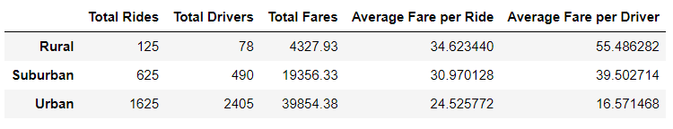

# Written Analysis: PyBer Analysis
> Analyzing data for ride sharing for Urban, suburban and Rural city types using Python, Pandas and Matplotlib.

## Table of Contents
* [Overview of the analysis](#overview-of-the-analysis)
* [Results](#results)
* [Summary](#summary)

## Overview of the analysis
The purpose of this analysis is to review the ride sharing data for Pyber, explore and get an understanding of the ridership and fare metrics by the three categorized city types. Along with this, the analysis also involves evaluating the corelation between the number the of riders and the drivers by city type and its correspondng impacts on he fares.The data was also used to create a new data frame to find the average fare per week from January 1st 2019 to April 29th 2019, for each of the city types. A visualisation of the results was produced using Matplotlib.

## Results

The following key metrics were calculated to observe and analyse some disparities in the three city types.

The ride-sharing summary below shows: the Total Rides, Total Drivers, the Total Fares, the Average Fare per Ride, and the Average Fare per Driver.

Based on the PyBer summary provided in the image, below are my observaions:

* The Total Rides in Urban city type is 1,625, which is 2.6 times more than Surburban city rides, and 13 times more than Rural city rides.

* The results demonstrate that the Total Drivers in Urban cities are 2,405, which is 4.9 times more than Surburban drivers, and 30.8 times more than Rural drivers.

* Total Fares illustrate that the fares in Urban city type is 2 times more than Surburban fares, and 9.2 times more than the fare in the rural city type.

* The Average Fare per Ride in the Urban area is $24.53, which is 0.8 times less than Suburban, and 0.7 times less than Rural areas.

* The Average Fare per Driver in Urban is $16.57, which is 0.4 times less than Suburban, and 0.3 times less than the Rural city area.

Overall it can be concluded that the data reflects logical deductions of ride-sharing trends, the further you get from city centers the less accessible ride-sharing services become. Urban city types have a far higher volume in total rides than both rural and suburban, but the average fare is smaller, possibly because of the duration of the ride. Nonetheless, urban riders bring in nearly 63% of the total revenue for Pyber. Rural areas on the other hand seem to be underserved and customers in those areas face more expensive fares than in Urban or Suburban city types.

Below is the multiple line graph of the total weekly fares for each city type showing the trend of Total Fares in $USD from January beginning to the end of April, 2019.

The multiple line graph "Total Fare by City Type" further supports the PyBer Summary by providing trends of total fares in rural, suburban, and urban city types between January 2019 and April 2019. The yellow trend shows how fares in urban cities totaled from around $1,600 USD to $2,300 USD from beginning to end during this time period. In contrast, the blue trend shows how fares in rural cities totaled around $300 USD from beginning to end during the same time period. The red trend shows how the total fares in suburban cities fall in between urban and rural cities, around $700 USD to $1,300 USD from beginning to end during this time. The chart further demonstrates similar peak times in all these types of cities. One noteworthy peak in total fares among urban, suburban, and rural cities occurred sometime at the end of February 2019.

## Summary

Based on the results, below are the three business recommendations for addressing disparities among the city types. 

   - The costs for using PyBer is greater among riders in rural cities than in urban cities. This could discourage potential riders from using PyBer given the high average fare per         ride.Decrease the cost of rides in the Suburban and Rural markets to encourage more consumers to use the PyBer service.
   - While the urban cities rides make more revenue, the rural cities rides are more profitable. So,focusing on improving profitability of urban cities rides may benefit Pyber.I would           recommend to reduce number of drivers in urban cities. There are 2,405 drivers which made only 1,625 rides. This means not every driver has done at least one ride. Reducing number of       drivers will increase average fare per driver.
   - Offering incentives to maintain loyal riders and drivers and attract new ones, will help drive business and strengthen relationships with existing riders and drivers.

Conducting further analysis on the usage and demographics of the riders could provide additional insights on different characteristics of a population. Having this data could prove to be useful in understanding consumer behavior, so that the brand can be appropriately marketed and developed, to target the specific demographic environment.
   

